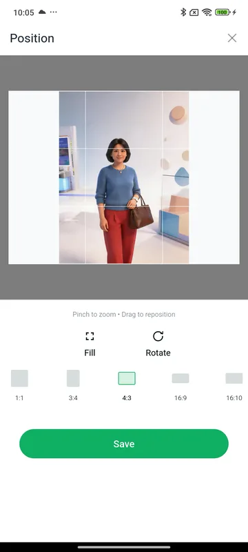
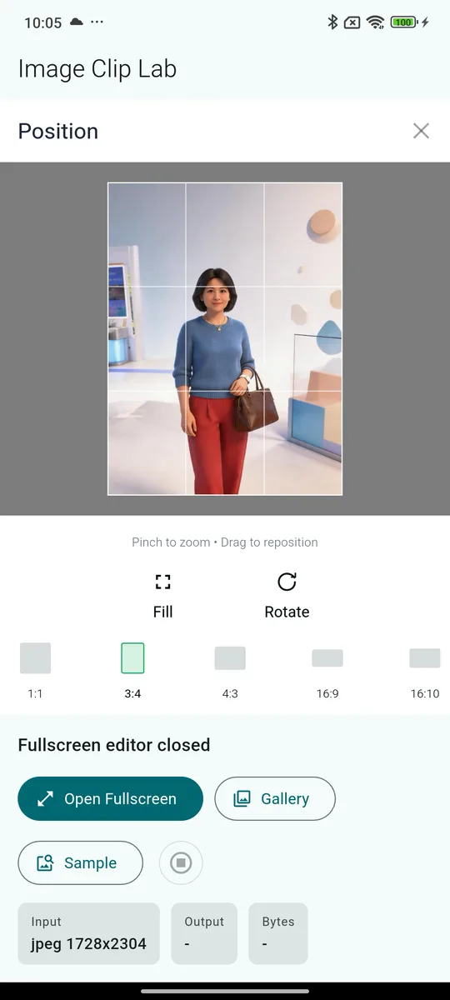

# flutter_image_clip

`flutter_image_clip` 是一个 Flutter 图片裁剪与位图处理库，提供可直接打开的裁剪 UI、可嵌入页面的裁剪组件，以及基于后台 isolate 的图像处理 API。

<p>
  
  
</p>

## 功能

- `showImageClipEditor`：一行代码打开完整裁剪界面。
- `ImageClipEditor`：可嵌入业务页面的裁剪 Widget。
- `ImageClipEditorController`：从父组件主动加载图片、重置视图、旋转和触发裁剪。
- 平台支持：Android 和 iOS。
- 手势支持：拖动、双指缩放、双击复位。
- 裁剪模式：可配置命名比例预设、Fit / Fill、90 度旋转。
- 文案配置：通过 `ImageClipEditorLabels` 覆盖按钮、状态、结果页文案，默认使用英文。
- 输出格式：裁剪结果可输出 PNG 或 JPEG，并可配置 JPEG quality。
- 图像处理：解码、中心裁剪、区域裁剪、旋转、翻转、缩放、调色、PNG/JPEG 导出。
- 输入探测：可在完整解码前识别 PNG、JPEG、GIF、WebP、HEIC、HEIF，用于移动端大图保护和格式提示。
- 预览解码：通过 `ImageClipDecodeSettings.preview` 为编辑器或业务预览生成小图，同时保留原图尺寸元数据。
- 原生解码适配：内置 `ImageClipPlatformDecodeAdapter`，也可通过 `ImageClipDecodeAdapter` 接入自定义 HEIC/HEIF 转码或平台 sampled decode。
- 文件链路：支持 `decodeFile`、`processFile` 和 `writeImageToFile`，本地文件输入会在后台 isolate 内读取。
- 批处理 pipeline：多步图像操作可合并为一次后台任务，减少重复编解码。
- 编辑会话：通过 `ImageClipSession` 持有连续编辑状态，减少业务层手动传递中间结果。
- 解码会话：通过 `ImageClipDecodedSession` 保留已解码像素，适合后台 isolate 或小图连续处理。
- 可取消任务：通过 `ImageClipTask` 监听进度、取消任务或设置超时。
- 处理任务通过后台 isolate 执行，并使用 `TransferableTypedData` 传输大字节数组，降低 UI isolate 压力。

## 安装

发布到 pub.dev 后，在业务项目的 `pubspec.yaml` 中添加：

```yaml
dependencies:
  flutter_image_clip: ^0.7.3
```

然后执行：

```sh
flutter pub get
```

如果发布前需要本地调试，可以临时使用 `path` 依赖：

```yaml
dependencies:
  flutter_image_clip:
    path: /Users/admin/Desktop/demos/flutter_image_clip_demo
```

## 文档导航

- [常见接入配方](guides/接入配方.md)：头像、封面、`image_picker`、HEIC、文件路径、大图和异常处理。
- [平台与 CI 矩阵](guides/平台矩阵.md)：Android/iOS 原生解码能力、设备测试覆盖和发布前校验。
- [可访问性检查清单](guides/可访问性检查清单.md)：VoiceOver、TalkBack、大字体、键盘和对比度验收项。
- [故障排查](guides/故障排查.md)：HEIC、大图内存、EXIF、golden、iOS privacy 和 pub.dev 自动发布问题。
- [迁移指南](guides/迁移指南.md)：按版本说明兼容性变化和升级检查项。
- [发布流程](guides/发布流程.md)：tag、release checks、pub.dev OIDC 自动发布和失败处理。
- [真实设备验收](guides/真实设备验收.md)：Android/iOS 真机图片样本和发布前验收记录。
- [真实设备验收记录](guides/真实设备验收记录.md)：逐版本真机验收状态表。
- [仓库信任与安全配置](guides/仓库信任与安全配置.md)：verified publisher、Dependency graph 和安全门禁配置。

## 使用裁剪 UI

默认编辑器采用移动端底部操作布局：顶部为 `Position` 标题和关闭按钮，中间为图片定位预览区，底部包含 Fit / Fill 切换、Rotate、比例选项和保存按钮。默认比例选项展示为 `3:4`、`4:3` 等比例文本。比例支持自定义：通过 `aspectRatios` 传入任意 `ImageClipAspectRatio(label, width, height)`，`label` 只负责 UI 文案，实际裁剪比例由 `width / height` 决定。需要固定主裁剪预览区高度时，可以设置 `cropAreaHeight`；不设置时继续自适应填满剩余空间。

```dart
import 'package:flutter_image_clip/flutter_image_clip.dart';

final result = await showImageClipEditor(
  context,
  imageBytes: bytes,
  imageLabel: 'avatar.jpg',
  initialAspectRatio: ImageClipAspectRatio.square,
  aspectRatios: const [
    ImageClipAspectRatio.square,
    ImageClipAspectRatio.portrait,
    ImageClipAspectRatio.landscape,
    ImageClipAspectRatio.widescreen,
    ImageClipAspectRatio.ratio16x10,
    ImageClipAspectRatio.ratio10x16,
  ],
  outputSettings: const ImageClipOutputSettings.jpeg(jpegQuality: 88),
  previewDecodeSettings: const ImageClipDecodeSettings.preview(
    targetLongSide: 1600,
  ),
  processingSettings: const ImageClipProcessingSettings(
    maxInputPixels: 48000000,
    maxOutputPixels: 16000000,
    autoDownscale: true,
  ),
  theme: ImageClipEditorTheme.fromColorScheme(
    Theme.of(context).colorScheme,
  ),
  cropAreaHeight: 456,
  onProgress: (progress) {
    debugPrint('${progress.stage.name}: ${progress.fraction}');
  },
);

if (result != null) {
  final croppedBytes = result.cropped.bytes;
  // 原图坐标：实际用于裁剪 source 的像素区域。
  final region = result.region;
  // 预览坐标：用户在旋转预览中看到的裁剪区域。
  final previewRegion = result.previewRegion;
  final rotationDegrees = result.rotationDegrees;
  final flippedHorizontally = result.flippedHorizontally;
  final flippedVertically = result.flippedVertically;
}
```

`ImageClipResult` 返回结构：

```dart
{
  source: EditedImage(...),
  cropped: EditedImage(...),
  region: CropRegion(
    x: 120,
    y: 0,
    width: 480,
    height: 640,
    cornerRadius: 0,
  ),
  previewRegion: CropRegion(
    x: 0,
    y: 120,
    width: 640,
    height: 480,
    cornerRadius: 0,
  ),
  rotationDegrees: 90,
  flippedHorizontally: true,
  flippedVertically: false,
}
```

## 嵌入页面

```dart
ImageClipEditor(
  initialImageBytes: bytes,
  initialImageLabel: 'cover.jpg',
  initialAspectRatio: const ImageClipAspectRatio(
    label: 'Banner',
    width: 16,
    height: 9,
  ),
  aspectRatios: const [
    ImageClipAspectRatio.square,
    ImageClipAspectRatio.widescreen,
    ImageClipAspectRatio.ratio16x10,
    ImageClipAspectRatio.ratio10x16,
    ImageClipAspectRatio(label: 'Banner', width: 3, height: 1),
  ],
  outputSettings: const ImageClipOutputSettings.png(),
  cropAreaHeight: 420,
  previewDecodeSettings: const ImageClipDecodeSettings.preview(
    targetLongSide: 1280,
  ),
  showResultPage: false,
  onResult: (result) {
    final croppedBytes = result.cropped.bytes;
  },
)
```

`previewDecodeSettings` 只约束编辑器交互预览。只要编辑器还持有原始输入 bytes，保存时会把预览裁剪框映射回原图坐标，并从原图导出最终结果。

## 使用控制器

`ImageClipEditorController` 适合头像上传、资料编辑器、表单页等需要由业务按钮驱动裁剪流程的场景。

```dart
final controller = ImageClipEditorController();

ImageClipEditor(
  controller: controller,
  loadSampleOnStart: false,
  showResultPage: false,
  onResult: (result) {
    final bytes = result.cropped.bytes;
  },
);

await controller.loadImage(bytes, label: 'avatar.jpg');
controller.resetView();
// 只更新编辑器预览，不会立即重编码整张图。
await controller.rotateRight();
await controller.flipHorizontal();

final result = await controller.crop();
if (result != null) {
  final croppedBytes = result.cropped.bytes;
}
final region = controller.currentCropRegion();
controller.cancelTask();
```

当新的图片加载请求早于旧请求完成时，编辑器会忽略旧请求的回写结果，避免业务快速切换图片时显示过期裁剪状态。

## 自定义编辑器文案

```dart
ImageClipEditor(
  labels: const ImageClipEditorLabels(
    editorTitle: 'Position',
    positionHint: 'Pinch to zoom • Drag to reposition',
    cancelButton: 'Close',
    saveButton: 'Use photo',
    fitButton: 'Fit',
    fillButton: 'Fill',
    rotateButton: 'Rotate',
    cropCompleteStatus: 'Photo cropped',
  ),
)
```

`flipHorizontalButton` 和 `flipVerticalButton` 仍会用于结果页元数据；默认编辑器工具栏不再展示翻转按钮，业务可以通过 `ImageClipEditorController.flipHorizontal()` 和 `ImageClipEditorController.flipVertical()` 主动触发。

顶部左侧标题通过 `ImageClipEditorLabels.editorTitle` 传入，底部提示文案通过 `ImageClipEditorLabels.positionHint` 传入；`showImageClipEditor` 和嵌入式 `ImageClipEditor` 两种入口都会使用同一套 `labels` 配置。

## 自定义主题

```dart
ImageClipEditor(
  theme: const ImageClipEditorTheme(
    backgroundColor: Color(0xFFFFFFFF),
    previewBackgroundColor: Color(0xFFF8F9FA),
    surfaceColor: Color(0xFFFFFFFF),
    imageBackgroundColor: Color(0xFFF8F9FA),
    primaryTextColor: Color(0xFF05120D),
    secondaryTextColor: Color(0xFF6A7282),
    accentColor: Color(0xFF10B062),
    accentSurfaceColor: Color(0xFFD6F1E1),
    onAccentColor: Color(0xFFFFFFFF),
    cropShadeColor: Color(0x80000000),
    cropBorderColor: Color(0xFFFFFFFF),
  ),
)
```

如果需要旧版深色视觉，可以使用 `const ImageClipEditorTheme.dark()` 作为起点再覆盖 token。

也可以从业务 App 的 `ColorScheme` 生成：

```dart
ImageClipEditor(
  theme: ImageClipEditorTheme.fromColorScheme(
    Theme.of(context).colorScheme,
  ),
)
```

工具栏高度、保存按钮尺寸和比例选项间距也可以通过同一个 theme 调整，便于业务 App 对齐自己的设计系统：

```dart
ImageClipEditor(
  theme: const ImageClipEditorTheme(
    topBarHeight: 60,
    bottomBarHeight: 320,
    compactBottomBarHeight: 200,
    bottomBarContentHeight: 320,
    maxSaveButtonWidth: 280,
    saveButtonHeight: 44,
    toolButtonGap: 36,
    aspectRatioGap: 18,
  ),
)
```

## 使用图像处理 API

```dart
final processor = ImageProcessor();

final info = processor.probeBytes(bytes);
debugPrint('${info.format.name} ${info.dimensionsLabel}');
if (!info.canDecodeWithDart) {
  // HEIC/HEIF should be converted by the platform picker or native layer first.
}

final image = await processor.decodeBytes(bytes, label: 'input.jpg');
final preview = await processor.decodePreviewBytes(
  bytes,
  label: 'input.jpg',
  targetLongSide: 1080,
);
debugPrint('${preview.dimensionsLabel} from ${preview.sourceWidth}x${preview.sourceHeight}');
final cropped = await processor.cropRegion(
  image,
  const CropRegion(x: 20, y: 20, width: 240, height: 240, cornerRadius: 0),
);
final rotated = await processor.rotate(
  cropped,
  degrees: 90,
  outputSettings: const ImageClipOutputSettings.jpeg(jpegQuality: 88),
);
final adjusted = await processor.adjustColor(
  rotated,
  const ColorAdjustment(brightness: 1.05, contrast: 1.1, saturation: 0.95),
);
final png = await processor.exportPng(adjusted);
final jpeg = await processor.exportJpeg(adjusted, quality: 88);
```

处理本地相册文件时可以直接走文件路径，避免业务层先把大图读成 `Uint8List`：

```dart
final result = await processor.processFile(
  '/path/to/camera.jpg',
  steps: const [
    ImageClipPipelineStep.cropRegion(
      CropRegion(x: 120, y: 80, width: 1200, height: 900, cornerRadius: 0),
    ),
  ],
  outputSettings: const ImageClipOutputSettings.jpeg(jpegQuality: 88),
);

await processor.writeImageToFile(result, '/path/to/cropped.jpg');
```

多步处理建议使用 pipeline，这样会在一次后台任务里完成 decode、transform 和 encode：

```dart
final result = await processor.processBytes(
  bytes,
  label: 'input.jpg',
  steps: const [
    ImageClipPipelineStep.rotate(),
    ImageClipPipelineStep.cropRegion(
      CropRegion(x: 20, y: 20, width: 240, height: 240, cornerRadius: 0),
    ),
    ImageClipPipelineStep.adjustColor(
      ColorAdjustment(brightness: 1.05, contrast: 1.1, saturation: 0.95),
    ),
  ],
  outputSettings: const ImageClipOutputSettings.jpeg(jpegQuality: 88),
);
```

连续编辑可以使用 session 持有当前图像状态：

```dart
final source = await processor.decodeBytes(bytes, label: 'input.jpg');
final session = ImageClipSession(image: source, processor: processor);

await session.rotate();
await session.flipHorizontal();
await session.cropRegion(
  const CropRegion(x: 20, y: 20, width: 240, height: 240, cornerRadius: 0),
);
final jpeg = await session.exportImage(
  outputSettings: const ImageClipOutputSettings.jpeg(jpegQuality: 88),
);
```

如果业务自己做编辑预览，可以使用 `ImageClipCropTransform` 复用编辑器的坐标映射逻辑：

```dart
const transform = ImageClipCropTransform(
  rotationDegrees: 90,
  flipHorizontal: true,
);

final sourceRegion = transform.sourceRegionForPreview(
  sourceWidth: source.width,
  sourceHeight: source.height,
  previewRegion: previewRegion,
);
```

如果连续处理已经运行在后台 isolate 中，或图片较小，可以使用 decoded session 避免中间结果重复编码：

```dart
final session = ImageClipDecodedSession.decode(bytes, label: 'input.jpg');
session.rotate();
session.cropRegion(
  const CropRegion(x: 20, y: 20, width: 240, height: 240, cornerRadius: 0),
);
final jpeg = session.exportImage(
  outputSettings: const ImageClipOutputSettings.jpeg(jpegQuality: 88),
);
```

如果需要进度、取消或超时控制，可以使用 task API：

```dart
final task = processor.processBytesTask(
  bytes,
  label: 'input.jpg',
  steps: const [
    ImageClipPipelineStep.rotate(),
    ImageClipPipelineStep.cropRegion(
      CropRegion(x: 20, y: 20, width: 240, height: 240, cornerRadius: 0),
    ),
  ],
  options: ImageClipTaskOptions(
    timeout: Duration(seconds: 8),
    onProgress: (progress) {
      debugPrint('${progress.message}: ${progress.fraction}');
    },
  ),
);

// task.cancel();
final result = await task.result;
```

`decodeBytes` 和后续裁剪/旋转处理会自动烘焙 EXIF orientation，手机拍摄的旋转照片会按视觉方向进入裁剪流程。

## 原生解码适配

`ImageClipPlatformDecodeAdapter` 会调用库内置的 Android/iOS 原生实现，在进入 Dart 图像管线前执行 HEIC/HEIF 转码或大图 sampled decode：

```dart
final processor = ImageProcessor(
  decodeAdapter: const ImageClipPlatformDecodeAdapter(),
);
```

如果业务需要接入自有相册 SDK 或图片服务，也可以实现 `ImageClipDecodeAdapter`：

```dart
class NativeDecodeAdapter extends ImageClipDecodeAdapter {
  const NativeDecodeAdapter();

  @override
  bool supportsDecode(
    ImageClipImageInfo info,
    ImageClipDecodeSettings settings,
  ) {
    return settings.usePlatformAdapter &&
        (!info.canDecodeWithDart || info.hasDimensions);
  }

  @override
  Future<ImageClipDecodeAdapterResult?> decode(
    Uint8List bytes, {
    required ImageClipImageInfo info,
    required String label,
    required ImageClipDecodeSettings settings,
  }) async {
    final normalizedBytes = await normalizeOnPlatform(
      bytes,
      targetLongSide: settings.targetLongSide,
    );
    return ImageClipDecodeAdapterResult(
      bytes: normalizedBytes.bytes,
      sourceWidth: normalizedBytes.sourceWidth,
      sourceHeight: normalizedBytes.sourceHeight,
    );
  }
}
```

平台侧会把常见失败映射为 Dart typed exception：不支持的格式抛出 `ImageClipUnsupportedFormatException`，参数或通道前置错误抛出 `ImageClipPlatformException`，原生解码或编码失败抛出 `ImageClipDecodeException`。

## 性能基准

```sh
dart run benchmark/image_processor_benchmark.dart
dart run benchmark/image_processor_benchmark.dart --json
dart run benchmark/image_processor_benchmark.dart --check benchmark/baseline.json
dart run tool/check_api_snapshot.dart
dart run tool/check_public_api_docs.dart
```

基准脚本会输出解码、旋转裁剪导出 JPEG、大图 downscale、JPEG 预览解码和文件路径裁剪导出的平均耗时、中位耗时、进程 RSS delta、输出尺寸和字节数。`--check` 会按 `benchmark/baseline.json` 检查中位耗时、内存变化和输出字节数，适合放进 CI 防止性能回退。`tool/check_api_snapshot.dart` 会检查核心公共 API 片段，避免无意破坏 semver；`tool/check_public_api_docs.dart` 会阻止新增公开 API 时漏写 dartdoc。

## 大图保护与异常处理

```dart
final processor = ImageProcessor(
  processingSettings: const ImageClipProcessingSettings(
    maxInputPixels: 48000000,
    maxOutputPixels: 16000000,
    autoDownscale: true,
  ),
);

try {
  final image = await processor.decodeBytes(bytes, label: 'camera.jpg');
  final cropped = await processor.cropRegion(
    image,
    const CropRegion(x: 0, y: 0, width: 1200, height: 1200, cornerRadius: 0),
  );
} on ImageClipImageTooLargeException catch (error) {
  debugPrint('Image is too large: ${error.width} x ${error.height}');
} on ImageClipDecodeException catch (error) {
  debugPrint(error.message);
}
```

默认配置会拒绝超过 4800 万像素的输入，并把超过 1600 万像素的输出自动 downscale。需要完全关闭限制时可使用：

```dart
const ImageClipProcessingSettings.unrestricted()
```

## 兼容性策略

业务侧应从 `package:flutter_image_clip/flutter_image_clip.dart` 导入公开 API，避免直接依赖 `src/` 下的内部实现。项目使用 `tool/check_api_snapshot.dart` 检查完整公开 API 快照；发布破坏性变更时提升主版本号，新增能力提升次版本号，纯修复提升 patch 版本，并在 `CHANGELOG.md` 中给出迁移说明。

根包兼容性声明为 Dart `>=3.10.0 <4.0.0`、Flutter `>=3.38.1`。CI 同时覆盖最低支持版本和最新 stable，避免示例 App 或工具链升级后虚标兼容范围。编辑器默认继承业务 App 字体，不随库打包自定义字体，避免增加包体积或覆盖业务品牌风格。

## 本地开发

```sh
flutter pub get
dart format lib test benchmark tool example/lib example/integration_test
flutter analyze
flutter test
dart run tool/check_api_snapshot.dart
dart run tool/check_public_api_docs.dart
dart run benchmark/image_processor_benchmark.dart --check benchmark/baseline.json
dart doc --output doc/api
dart pub publish --dry-run
cd example
flutter pub get
flutter test integration_test
flutter run
```

## 许可证

MIT License。详见 `LICENSE`。
